# ChatRoomClient

## 功能展示

### 客户端启动

```
java -jar .\ChatRoomClient.jar
```

输入用户名、UDP 端口和 TCP 端口

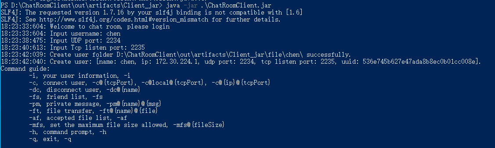


### 查看个人信息

```
-i
```

输出个人信息包括：

- 姓名
- ip 地址
- UDP 和 TCP 端口号
- UUID，暂时未起作用

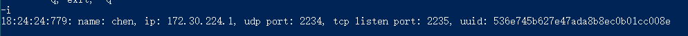


### 连接用户

包含三种形式的命令，通过 IP 和 TCP 端口连接

```
-c@2257   // 默认连接本地 ip
-c@local@2257    // 连接本地 ip 的 2257 端口
-c@192.168.5.1@2257   // 连接 192.168.5.1 的 2257 端口
```

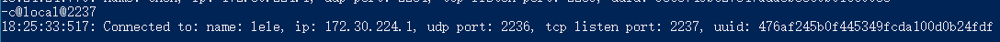


### 查看好友

```
-fs
```

显示出所有与你连接的好友

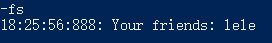


### 私信用户

```
-pm@lele@ni hao   // 给好友 lele 发送 ni hao 消息
```

发送端

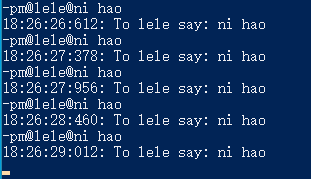

接收端

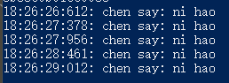


### 文件传输

首先发送端输入文件传输请求

```
-ft@chen@E:\LLVM-14.0.0-win64.exe   // 给好友 lele 发送文件 E:\LLVM-14.0.0-win64.exe
```

该文件传输请求会添加到接收方的传输列表中


接收方会被提示有新的文件请求


接收方可以通过一下命令查看文件传输请求列表

```
-rrl
```

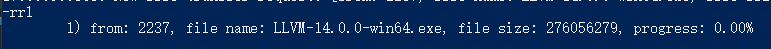

会显示任务索引、发送方、文件名称、文件大小和传输进度

接收方可以通过以下命令开始接受传输

```
-a@1   \\ 表示接受索引为 1 的文件传输请求
```


在传输的过程我们可以停止接收

```
-p@1   // 停止索引为 1 的文件接收任务
```

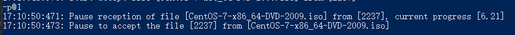

也可以拒绝任务

```
-r@1   // 拒绝索引为 1 的文件接收任务
```

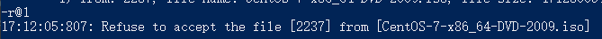


### 删除好友

```
-dc@chen   // 删除好友 chen
```

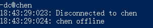


### 设置允许的最大文件大小

```
-mfs@5000000   // 设置允许接收的最大文件大小为 5000000
```


### 查看接收的文件列表

```
-af
```

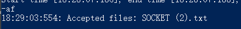


### 命令提示

```
-h
```

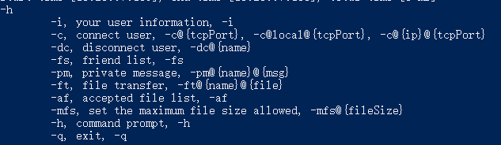


### 退出

```
-q
```

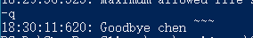
